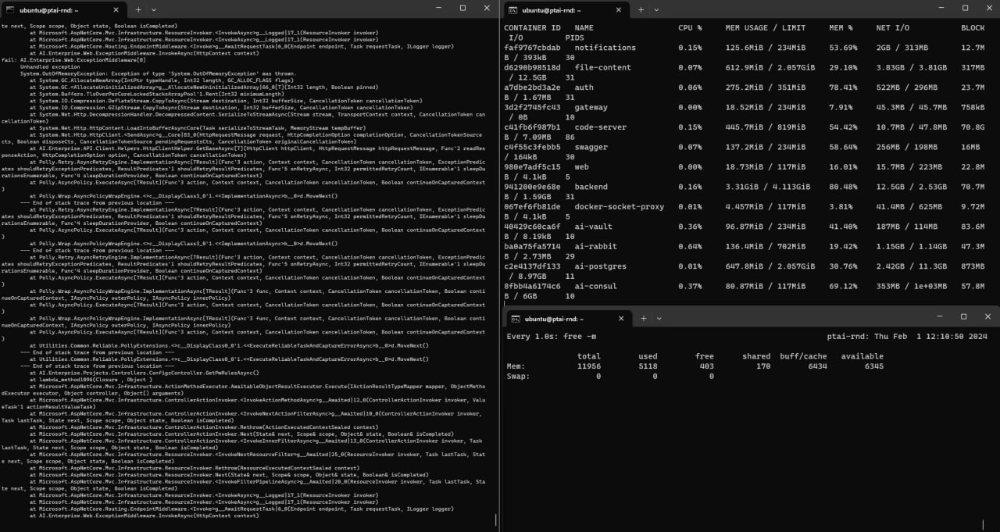

# PT AI Server docker container memory limit changer
PT AI Server по документации требует 16ГБ оперативной памяти, хотя фактическое потребление памяти гораздо ниже. Однако, если предоставить серверу меньше 16 ГБ, есть высокая вероятность получить ошибки OOM (см. раздел Proof ниже).

Данный скрипт рекомендуется к использованию на пилотных проектах и позволяет обеспечить работу сервера на машине от 8ГБ оперативной памяти.

## Как?
В установочной директории есть shell скрипт, отвечающий за расчёт лимитов docker контейнеров системы: 
`/opt/ptai/latest/lib/reconf.sh`
Его формула следующая:
`mem_base=$((mem_free / counter / 1024))`

- `mem_free` = вся оперативная память хоста минус 300 Мб
- `counter` = количество долей для распределения памяти контейнерам (доли указаны в env/resources_env.sh)

То есть сумма лимитов всех контейнеров равна памяти хоста минус 300 Мб. Казалось бы это логично, но на практике контейнеры неравномерно используют свободную память, что приводит к внезапным ошибкам OOM.
Скрипт выполняет патчинг этой формулы, увеличивая в расчётах общую память на указанный процент.

## Запуск
Скрипт принимает единственный параметр: процент, на который нужно увеличить лимиты. Рекомендуемое значение 30.
```
chmod +x ptaimemlimit.sh
sh ptaimemlimit.sh 30
```
В случае успеха, выполняется перезагрузка сервера PT AI.

## Откатить сделанные изменения
`mv /opt/ptai/latest/lib/reconf.sh.bckp /opt/ptai/latest/lib/reconf.sh`

## Устойчивость к обновлениям
При обновлении сервера PT AI фикс может слететь. Чтобы этого не произошло, добавьте скрипт на расписание в cron:
`0 5 * * * /home/ubuntu/ptaimemlimit.sh 30`
Скрипт выполняет перезагрузку сервера только при успешном патчинге, т.е. его запуск на пропатченной системе не приводит к перезапуску.

## Proof
На данном рисунке видно, что на хосте свободно 6ГБ оперативной памяти, однако сервер сыпет ошибки OOM на некоторые тяжелые запросы к бэкенду.


